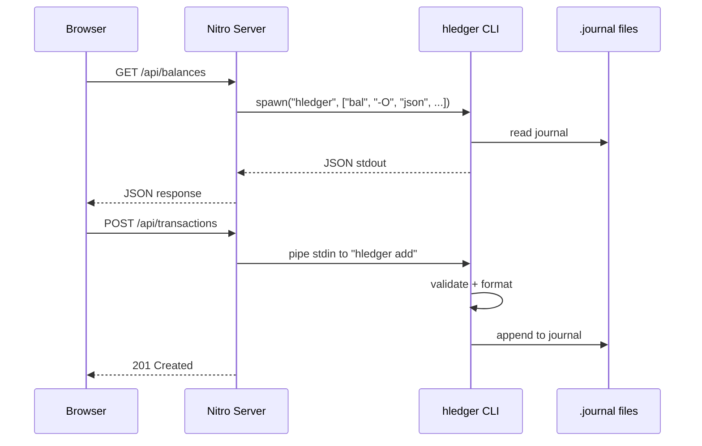

# Design Document: hledger Budget App — Basics

## Overview

Foundational scaffolding for a Nuxt 4 + Nuxt UI app wrapping the hledger CLI. All UI is built with Nuxt UI components (UTable, UCard, etc. — no raw HTML or hand-rolled Vue components). This phase covers: project init, a single `hledger` utility module (no classes), shared types, three API routes, a minimal dashboard page, and Docker Compose setup.

## Main Algorithm/Workflow



## Core Types

```typescript
// types/hledger.ts — Mirrors hledger's JSON output shapes

export interface HledgerAmount {
  commodity: string
  quantity: number
}

export interface HledgerPosting {
  account: string
  amounts: HledgerAmount[]
}

export interface HledgerTransaction {
  date: string
  status: '' | '!' | '*'
  description: string
  postings: HledgerPosting[]
  index: number
}

export interface HledgerBalanceRow {
  account: string
  amounts: HledgerAmount[]
}

export interface HledgerBalanceReport {
  rows: HledgerBalanceRow[]
  totals: HledgerAmount[]
}

// types/api.ts — API request shapes

export interface TransactionInput {
  date: string                // YYYY-MM-DD
  description: string
  postings: PostingInput[]
  status?: '' | '!' | '*'
}

export interface PostingInput {
  account: string
  amount?: number
  commodity?: string          // defaults to "$"
}

export interface BalanceQuery {
  period?: string
  account?: string
  depth?: number
}

export interface TransactionQuery {
  startDate?: string
  endDate?: string
  account?: string
}
```

## Server Utils — `server/utils/hledger.ts`

Plain functions instead of classes. Nitro auto-imports from `server/utils/`, so no singleton wiring needed.

All journal reads and writes go through hledger. For writes, we pipe transaction data to `hledger add` via stdin — hledger handles formatting, validation, and appending to the journal file. The app never touches the journal directly.

The stdin protocol for `hledger add` is: `date\ndescription\n[account\namount\n]...\n.\ny\n.\n`. Explicit values override any defaults hledger suggests from similar existing transactions.

```typescript
import { spawn } from 'node:child_process'

/** Resolve journal path from env, with Docker default fallback */
export function resolveJournalPath(): string {
  return process.env.LEDGER_FILE || '/data/main.journal'
}

/** Run an hledger command and return parsed JSON */
export async function hledgerExec(args: string[]): Promise<unknown> {
  const file = resolveJournalPath()
  const fullArgs = [...args, '-f', file, '-O', 'json']
  const proc = spawn('hledger', fullArgs)

  let stdout = '', stderr = ''
  proc.stdout.on('data', (c) => { stdout += c })
  proc.stderr.on('data', (c) => { stderr += c })

  const code = await new Promise<number>((res) => proc.on('close', res))
  if (code !== 0) throw new Error(`hledger error: ${stderr}`)
  return JSON.parse(stdout)
}

/** Add a transaction by piping input to hledger add via stdin */
export async function addTransaction(input: TransactionInput): Promise<void> {
  const file = resolveJournalPath()
  const proc = spawn('hledger', ['add', '-f', file])

  let stderr = ''
  proc.stderr.on('data', (c) => { stderr += c })

  // Build stdin lines: date, description, then account/amount pairs, end postings, save, quit
  const lines: string[] = [input.date, input.description]
  for (const p of input.postings) {
    lines.push(p.account)
    if (p.amount !== undefined) {
      const c = p.commodity ?? '$'
      lines.push(`${c}${p.amount.toFixed(2)}`)
    } else {
      lines.push('')  // accept hledger's inferred amount
    }
  }
  lines.push('.', 'y', '.')  // end postings, confirm save, quit

  proc.stdin.write(lines.join('\n') + '\n')
  proc.stdin.end()

  const code = await new Promise<number>((res) => proc.on('close', res))
  if (code !== 0) throw new Error(`hledger add failed: ${stderr}`)
}
```

## API Routes

### GET /api/balances — `server/api/balances.get.ts`

```typescript
export default defineEventHandler(async (event) => {
  const { period, account, depth } = getQuery(event)
  const args = ['bal']
  if (period) args.push('-p', String(period))
  if (account) args.push(String(account))
  if (depth) args.push('--depth', String(depth))
  return await hledgerExec(args)
})
```

### GET /api/transactions — `server/api/transactions.get.ts`

```typescript
export default defineEventHandler(async (event) => {
  const { startDate, endDate, account } = getQuery(event)
  const args = ['print']
  if (startDate) args.push('-b', String(startDate))
  if (endDate) args.push('-e', String(endDate))
  if (account) args.push(String(account))
  return await hledgerExec(args)
})
```

### POST /api/transactions — `server/api/transactions.post.ts`

```typescript
export default defineEventHandler(async (event) => {
  const body = await readBody<TransactionInput>(event)
  if (!body.date || !body.description || !body.postings?.length) {
    throw createError({ statusCode: 400, message: 'Missing required fields' })
  }
  if (body.postings.length < 2) {
    throw createError({ statusCode: 400, message: 'At least 2 postings required' })
  }
  await addTransaction(body)
  setResponseStatus(event, 201)
  return { success: true }
})
```

### GET /api/accounts — `server/api/accounts.get.ts`

```typescript
export default defineEventHandler(async () => {
  return await hledgerExec(['accounts'])
})
```

## Correctness Properties

*A property is a characteristic or behavior that should hold true across all valid executions of a system — essentially, a formal statement about what the system should do. Properties serve as the bridge between human-readable specifications and machine-verifiable correctness guarantees.*

### Property 1: addTransaction round-trip

*For any* valid `TransactionInput`, after `addTransaction(input)` succeeds, the journal file should contain a transaction matching the input's date, description, accounts, and amounts.

**Validates: Requirement 5.1**

### Property 2: addTransaction rejects invalid input

*For any* `TransactionInput` with unbalanced explicit amounts, `addTransaction` should throw an error and the journal file should be unchanged.

**Validates: Requirement 5.2**

### Property 3: Path resolution returns a non-empty string

*For any* environment configuration (whether `LEDGER_FILE` is set to an arbitrary non-empty string or is unset), `resolveJournalPath()` should return a non-empty string matching the expected value.

**Validates: Requirements 1.1, 1.3**

### Property 4: hledger is the sole journal writer

*For any* call to `addTransaction`, the app should not directly write to the journal file — only `hledger add` modifies the file.

**Validates: Requirement 5.3**

## Docker Setup

### Dockerfile

```dockerfile
FROM node:20-alpine AS build
WORKDIR /app
COPY package*.json ./
RUN npm ci
COPY . .
RUN npm run build

FROM node:20-alpine
RUN apk add --no-cache hledger
WORKDIR /app
COPY --from=build /app/.output .output/
ENV LEDGER_FILE=/data/main.journal
ENV HOST=0.0.0.0
ENV PORT=3000
EXPOSE 3000
CMD ["node", ".output/server/index.mjs"]
```

### docker-compose.yml

```yaml
services:
  app:
    build: .
    ports:
      - "3000:3000"
    volumes:
      - journal-data:/data
    environment:
      - LEDGER_FILE=/data/main.journal

volumes:
  journal-data:
```

### nuxt.config.ts

```typescript
export default defineNuxtConfig({
  compatibilityDate: '2025-01-01',
  modules: ['@nuxt/ui'],
  devtools: { enabled: true },
})
```
