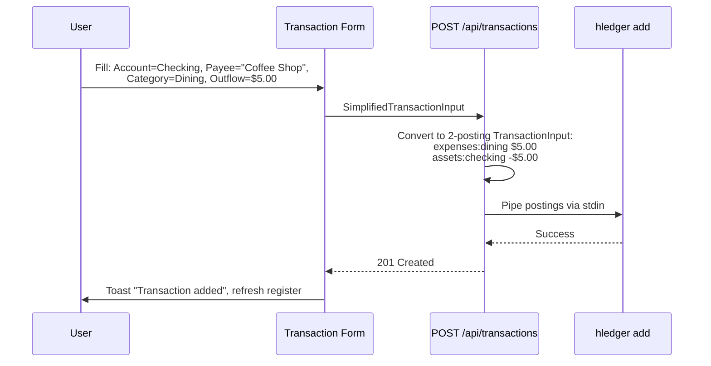
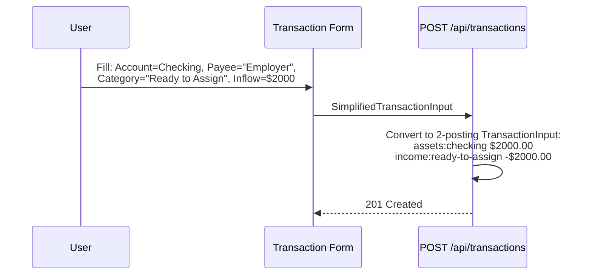
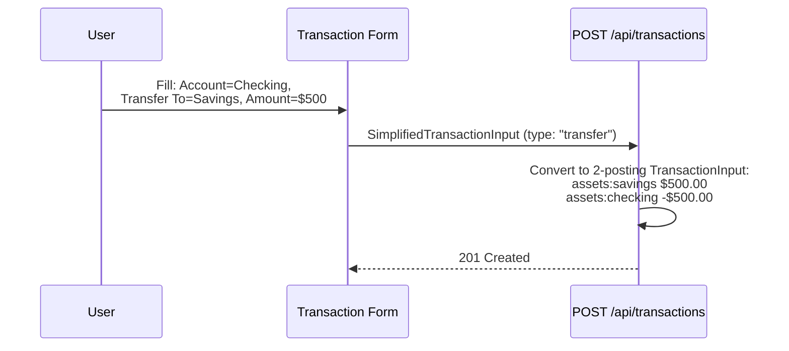
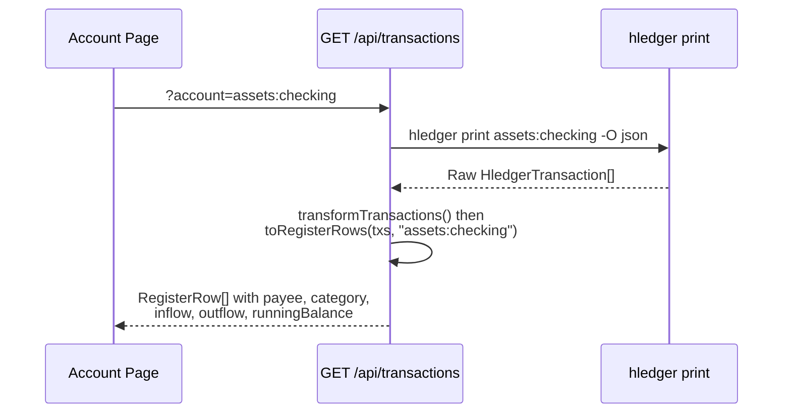
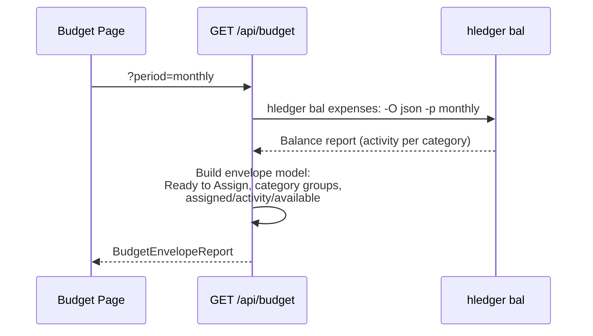

# Design Document: YNAB-Style Simplified Transaction Model

## Overview

This feature replaces the raw double-entry posting UI with a YNAB-inspired UX where users interact with Accounts, Payees, Categories, and Inflow/Outflow fields. The underlying hledger journal still uses standard double-entry postings, but the app translates between the simplified user model and hledger's format transparently.

The scope covers: a new simplified transaction form, a YNAB-style account register view, sidebar filtering to show only real accounts (assets/liabilities), a budget page with envelope-style category management, and all supporting API/type/composable changes. The hledger CLI remains the single source of truth for all accounting data.

## Architecture

```
mermaid
graph TD
    subgraph Browser
        SF[Simplified Transaction Form]
        AR[Account Register View]
        BP[Budget Page]
        SB[Sidebar - Real Accounts Only]
    end

    subgraph "Nuxt Server (Nitro)"
        TXA[POST /api/transactions<br/>accepts SimplifiedTransactionInput]
        TXG[GET /api/transactions<br/>returns RegisterRow[]]
        ACCT[GET /api/accounts<br/>?type=real|category|all]
        BAL[GET /api/balances]
        BUD[GET /api/budget<br/>envelope model]
        CAT[POST /api/categories<br/>manage budget categories]
    end

    subgraph "hledger CLI"
        ADD[hledger add]
        PRINT[hledger print -O json]
        BALS[hledger bal -O json]
        ACCTS[hledger accounts]
    end

    SF -->|SimplifiedTransactionInput| TXA
    TXA -->|TransactionInput with 2 postings| ADD
    AR -->|fetch register| TXG
    TXG -->|raw JSON| PRINT
    BP --> BUD
    BUD --> BALS
    SB --> ACCT
    ACCT --> ACCTS
    BAL --> BALS
    CAT -->|create hledger account| ADD
```


## Sequence Diagrams

### Adding an Expense Transaction



### Adding an Income Transaction



### Adding a Transfer



### Loading Account Register



### Loading Budget Page




## Components and Interfaces

### Component 1: Simplified Transaction Form

**Purpose**: Replaces the raw postings form with YNAB-style fields (Account, Payee, Category, Inflow/Outflow). Generates correct 2-posting hledger transactions.

**Responsibilities**:
- Render date, account dropdown, payee text input, category dropdown, inflow/outflow fields
- Enforce mutual exclusivity between inflow and outflow (entering one clears the other)
- Switch to transfer mode when user selects a transfer target instead of a category
- Validate form before submission
- Convert simplified input to `SimplifiedTransactionInput` for the API

### Component 2: Account Register View

**Purpose**: Displays transactions for a single account in YNAB register format (Date, Payee, Category, Inflow, Outflow, Running Balance).

**Responsibilities**:
- Fetch transactions filtered by account
- Derive payee from transaction description
- Derive category from the "other" posting's account (strip prefix)
- Split amount into inflow/outflow columns based on sign
- Compute running balance as cumulative sum
- Color inflows green, outflows red, transfers neutral

### Component 3: Sidebar (Real Accounts Only)

**Purpose**: Filter the account tree to show only real financial accounts (assets + liabilities), hiding expense/income categories.

**Responsibilities**:
- Filter `useAccounts()` results to only `assets:*` and `liabilities:*`
- Strip hledger prefix for display (e.g., `assets:checking` → "Checking")
- Maintain existing tree structure and navigation behavior

### Component 4: Budget Page (Envelope Model)

**Purpose**: YNAB-style budget view with Ready to Assign, category groups, and per-category Assigned/Activity/Available columns.

**Responsibilities**:
- Calculate "Ready to Assign" (total income minus total assigned)
- Group categories by top-level expense account (category groups)
- Show Assigned, Activity, Available per category
- Allow assigning money to categories (future: budget directives)
- Manage categories (add/rename/delete expense accounts)

### Component 5: Transaction-to-Postings Converter (Server)

**Purpose**: Server-side utility that converts `SimplifiedTransactionInput` into a standard `TransactionInput` with correct hledger postings.

**Responsibilities**:
- Map expense → `[expenses:category +amount, account -amount]`
- Map income → `[account +amount, income:category -amount]`
- Map transfer → `[targetAccount +amount, sourceAccount -amount]`
- Validate that the generated postings balance to zero


## Data Models

### SimplifiedTransactionInput (New — replaces raw PostingInput for user-facing form)

```typescript
/** Transaction types from the user's perspective */
type TransactionType = 'expense' | 'income' | 'transfer'

/** What the simplified form submits to the API */
interface SimplifiedTransactionInput {
  date: string                    // YYYY-MM-DD
  payee: string                   // Free text — who you paid/received from
  account: string                 // Full hledger account path (e.g., "assets:checking")
  type: TransactionType
  /** For expense/income: the category (e.g., "expenses:groceries", "income:salary") */
  category?: string
  /** For transfers: the target account (e.g., "assets:savings") */
  transferAccount?: string
  /** Positive number — direction determined by type + which column user entered */
  amount: number
  commodity?: string              // Defaults to "$"
  status?: '' | '!' | '*'
}
```

**Validation Rules**:
- `date` must match `YYYY-MM-DD` format
- `payee` must be non-empty
- `account` must be non-empty and start with `assets:` or `liabilities:`
- `amount` must be > 0
- If `type === 'expense'`: `category` required, must start with `expenses:`
- If `type === 'income'`: `category` required, must start with `income:`
- If `type === 'transfer'`: `transferAccount` required, must start with `assets:` or `liabilities:`, must differ from `account`

### SimplifiedFormState (New — replaces TransactionFormState for the UI)

```typescript
/** Shape of the simplified add-transaction form state */
interface SimplifiedFormState {
  date: string
  payee: string
  account: string                 // Selected from account dropdown
  category: string                // Selected from category dropdown (or empty for transfers)
  transferAccount: string         // Selected from account dropdown (for transfers)
  inflow: string                  // User-entered amount string (mutually exclusive with outflow)
  outflow: string                 // User-entered amount string (mutually exclusive with inflow)
  status: '' | '!' | '*'
}
```

### RegisterRow (New — what the account register displays)

```typescript
/** A single row in the YNAB-style account register */
interface RegisterRow {
  date: string
  payee: string                   // From transaction description
  category: string                // Derived from other posting, prefix stripped
  categoryRaw: string             // Full hledger account path of other posting
  inflow: number | null           // Positive amount entering account, or null
  outflow: number | null          // Positive amount leaving account, or null
  runningBalance: number          // Cumulative balance up to this row
  isTransfer: boolean             // True if other posting is also assets/liabilities
  transactionIndex: number        // hledger tindex for edit/delete
  status: '' | '!' | '*'
}
```

### BudgetEnvelopeReport (New — replaces BudgetReport)

```typescript
/** A single category in the budget envelope view */
interface BudgetCategory {
  name: string                    // Display name (e.g., "Groceries")
  accountPath: string             // Full hledger path (e.g., "expenses:groceries")
  assigned: number                // Amount budgeted to this category
  activity: number                // Amount spent (from actual transactions)
  available: number               // assigned - |activity|
}

/** A group of categories (e.g., "Bills", "Everyday") */
interface BudgetCategoryGroup {
  name: string                    // Group display name
  categories: BudgetCategory[]
  /** Totals for the group */
  assigned: number
  activity: number
  available: number
}

/** Full budget page data */
interface BudgetEnvelopeReport {
  period: string                  // e.g., "2025-01"
  readyToAssign: number           // Total income - total assigned
  categoryGroups: BudgetCategoryGroup[]
  totalAssigned: number
  totalActivity: number
  totalAvailable: number
}
```

### RealAccount (New — for sidebar/account list filtering)

```typescript
/** An account shown in the sidebar (real financial accounts only) */
interface RealAccount {
  fullPath: string                // e.g., "assets:checking"
  displayName: string             // e.g., "Checking" (prefix stripped
, title-cased)
  type: 'asset' | 'liability'
  balance: number
  commodity: string
}
```

## Key Functions with Formal Specifications

### Function 1: toTransactionInput()

```typescript
function toTransactionInput(input: SimplifiedTransactionInput): TransactionInput
```

**Preconditions:**
- `input` passes all validation rules defined in SimplifiedTransactionInput
- `input.amount > 0`
- `input.account` is a valid hledger account path

**Postconditions:**
- Returns a `TransactionInput` with exactly 2 postings
- The two postings' amounts sum to zero (balanced transaction)
- `result.description === input.payee`
- `result.date === input.date`
- For expense: posting[0].account starts with `expenses:`, posting[1].account === input.account
- For income: posting[0].account === input.account, posting[1].account starts with `income:`
- For transfer: posting[0].account === input.transferAccount, posting[1].account === input.account

**Loop Invariants:** N/A

### Function 2: toRegisterRows()

```typescript
function toRegisterRows(
  transactions: HledgerTransaction[],
  accountPath: string
): RegisterRow[]
```

**Preconditions:**
- `transactions` is an array of valid HledgerTransaction objects
- `accountPath` is a non-empty string matching a real account
- Each transaction has at least 2 postings

**Postconditions:**
- Returns one RegisterRow per transaction
- Each row has exactly one of `inflow` or `outflow` set (the other is null)
- `inflow` values are always > 0, `outflow` values are always > 0
- `runningBalance` for row[i] === sum of all (inflow - outflow) for rows[0..i]
- `isTransfer === true` iff the other posting's account starts with `assets:` or `liabilities:`
- `category` is the other posting's account with the top-level prefix stripped and title-cased
- For transfers, `payee` is prefixed with "Transfer: " + other account display name

**Loop Invariants:**
- Running balance accumulator equals the sum of all processed rows' net amounts

### Function 3: filterRealAccounts()

```typescript
function filterRealAccounts(accounts: string[]): string[]
```

**Preconditions:**
- `accounts` is an array of hledger account path strings

**Postconditions:**
- Returns only accounts starting with `assets:` or `liabilities:`
- Preserves original order
- Result is a subset of input (no new accounts created)

**Loop Invariants:** N/A

### Function 4: validateSimplifiedForm()

```typescript
function validateSimplifiedForm(state: SimplifiedFormState): string[]
```

**Preconditions:**
- `state` is a SimplifiedFormState object (all fields present, may be empty strings)

**Postconditions:**
- Returns empty array if form is valid
- Returns non-empty array of human-readable error messages if invalid
- Validates: date format, payee non-empty, account selected, amount > 0
- Validates mutual exclusivity: exactly one of inflow/outflow must be filled
- If category is empty and transferAccount is empty → error
- No side effects on input state

**Loop Invariants:** N/A

### Function 5: stripAccountPrefix()

```typescript
function stripAccountPrefix(accountPath: string): string
```

**Preconditions:**
- `accountPath` is a non-empty colon-separated hledger account path

**Postconditions:**
- Removes the first segment (e.g., `expenses:groceries` → `groceries`, `assets:bank:checking` → `bank:checking`)
- Title-cases each segment for display (e.g., `groceries` → "Groceries", `bank:checking` → "Bank: Checking")
- Returns original string if no colon found

**Loop Invariants:** N/A

### Function 6: deriveTransactionType()

```typescript
function deriveTransactionType(formState: SimplifiedFormState): TransactionType
```

**Preconditions:**
- `formState` has `inflow`, `outflow`, `category`, and `transferAccount` fields

**Postconditions:**
- Returns `'transfer'` if `transferAccount` is non-empty
- Returns `'income'` if `inflow` is non-empty and `outflow` is empty
- Returns `'expense'` if `outflow` is non-empty and `inflow` is empty
- Throws if both `inflow` and `outflow` are filled (should be caught by validation)

**Loop Invariants:** N/A


## Algorithmic Pseudocode

### Transaction Conversion Algorithm

```typescript
function toTransactionInput(input: SimplifiedTransactionInput): TransactionInput {
  const { date, payee, account, type, category, transferAccount, amount, commodity = '$', status = '*' } = input

  // ASSERT: amount > 0
  // ASSERT: account starts with 'assets:' or 'liabilities:'

  let postings: PostingInput[]

  if (type === 'expense') {
    // ASSERT: category starts with 'expenses:'
    // Money flows: account → category
    postings = [
      { account: category!, amount: amount, commodity },        // debit expense
      { account: account, amount: -amount, commodity },         // credit source account
    ]
  } else if (type === 'income') {
    // ASSERT: category starts with 'income:'
    // Money flows: category → account
    postings = [
      { account: account, amount: amount, commodity },          // debit destination account
      { account: category!, amount: -amount, commodity },       // credit income source
    ]
  } else {
    // type === 'transfer'
    // ASSERT: transferAccount starts with 'assets:' or 'liabilities:'
    // ASSERT: transferAccount !== account
    // Money flows: account → transferAccount
    postings = [
      { account: transferAccount!, amount: amount, commodity }, // debit destination
      { account: account, amount: -amount, commodity },         // credit source
    ]
  }

  // POSTCONDITION: postings[0].amount + postings[1].amount === 0
  return { date, description: payee, postings, status }
}
```

### Register Row Derivation Algorithm

```typescript
function toRegisterRows(
  transactions: HledgerTransaction[],
  accountPath: string
): RegisterRow[] {
  let runningBalance = 0
  const rows: RegisterRow[] = []

  for (const tx of transactions) {
    // Find the posting that matches the current account
    const thisPosting = tx.postings.find(p =>
      p.account === accountPath || p.account.startsWith(accountPath + ':')
    )
    if (!thisPosting || !thisPosting.amounts[0]) continue

    // The "other" posting determines category/transfer target
    const otherPosting = tx.postings.find(p => p !== thisPosting)
    const otherAccount = otherPosting?.account ?? ''

    const amount = thisPosting.amounts[0].quantity
    const isTransfer = otherAccount.startsWith('assets:') || otherAccount.startsWith('liabilities:')

    // Determine inflow vs outflow from sign
    const inflow = amount > 0 ? amount : null
    const outflow = amount < 0 ? Math.abs(amount) : null

    // Update running balance
    runningBalance += amount

    // Derive display category
    const category = isTransfer
      ? ''  // transfers have no category
      : stripAccountPrefix(otherAccount)

    // Derive payee — for transfers, show "Transfer: <other account>"
    const payee = isTransfer
      ? `Transfer: ${stripAccountPrefix(otherAccount)}`
      : tx.description

    rows.push({
      date: tx.date,
      payee,
      category,
      categoryRaw: otherAccount,
      inflow,
      outflow,
      runningBalance,
      isTransfer,
      transactionIndex: tx.index,
      status: tx.status,
    })

    // LOOP INVARIANT: runningBalance === sum of all amounts for accountPath across rows[0..current]
  }

  return rows
}
```

### Account Filtering Algorithm

```typescript
function filterRealAccounts(accounts: string[]): string[] {
  return accounts.filter(a => a.startsWith('assets:') || a.startsWith('liabilities:'))
}

function filterCategoryAccounts(accounts: string[]): string[] {
  return accounts.filter(a => a.startsWith('expenses:') || a.startsWith('income:'))
}
```

### Form State to API Input Conversion

```typescript
function formStateToInput(state: SimplifiedFormState): SimplifiedTransactionInput {
  const type = deriveTransactionType(state)
  const amount = parseFloat(state.inflow || state.outflow)

  // ASSERT: amount > 0 (validated before calling)

  return {
    date: state.date,
    payee: state.payee,
    account: state.account,
    type,
    category: type !== 'transfer' ? state.category : undefined,
    transferAccount: type === 'transfer' ? state.transferAccount : undefined,
    amount,
    status: state.status,
  }
}
```


## Example Usage

### Adding an Expense

```typescript
// User fills form: Account=Checking, Payee="Coffee Shop", Category=Dining, Outflow=$5.00
const formState: SimplifiedFormState = {
  date: '2025-01-15',
  payee: 'Coffee Shop',
  account: 'assets:checking',
  category: 'expenses:dining',
  transferAccount: '',
  inflow: '',
  outflow: '5.00',
  status: '*',
}

// Validate
const errors = validateSimplifiedForm(formState)
// errors === []

// Convert to API input
const input = formStateToInput(formState)
// input === {
//   date: '2025-01-15', payee: 'Coffee Shop', account: 'assets:checking',
//   type: 'expense', category: 'expenses:dining', amount: 5.00, status: '*'
// }

// Server converts to hledger postings
const txInput = toTransactionInput(input)
// txInput === {
//   date: '2025-01-15', description: 'Coffee Shop', status: '*',
//   postings: [
//     { account: 'expenses:dining', amount: 5.00, commodity: '$' },
//     { account: 'assets:checking', amount: -5.00, commodity: '$' },
//   ]
// }
```

### Viewing Account Register

```typescript
// Raw hledger transactions for assets:checking
const transactions: HledgerTransaction[] = [
  {
    date: '2025-01-15', description: 'Coffee Shop', status: '*', index: 42,
    postings: [
      { account: 'expenses:dining', amounts: [{ commodity: '$', quantity: 5.00 }] },
      { account: 'assets:checking', amounts: [{ commodity: '$', quantity: -5.00 }] },
    ]
  },
  {
    date: '2025-01-16', description: 'Employer', status: '*', index: 43,
    postings: [
      { account: 'assets:checking', amounts: [{ commodity: '$', quantity: 2000.00 }] },
      { account: 'income:salary', amounts: [{ commodity: '$', quantity: -2000.00 }] },
    ]
  },
]

const rows = toRegisterRows(transactions, 'assets:checking')
// rows === [
//   { date: '2025-01-15', payee: 'Coffee Shop', category: 'Dining',
//     inflow: null, outflow: 5.00, runningBalance: -5.00, isTransfer: false },
//   { date: '2025-01-16', payee: 'Employer', category: 'Salary',
//     inflow: 2000.00, outflow: null, runningBalance: 1995.00, isTransfer: false },
// ]
```

### Sidebar Filtering

```typescript
const allAccounts = [
  'assets:checking', 'assets:savings', 'expenses:groceries',
  'expenses:dining', 'income:salary', 'liabilities:credit-card'
]

const realAccounts = filterRealAccounts(allAccounts)
// ['assets:checking', 'assets:savings', 'liabilities:credit-card']

const categories = filterCategoryAccounts(allAccounts)
// ['expenses:groceries', 'expenses:dining', 'income:salary']
```

## Correctness Properties

*A property is a characteristic or behavior that should hold true across all valid executions of a system — essentially, a formal statement about what the system should do. Properties serve as the bridge between human-readable specifications and machine-verifiable correctness guarantees.*

### Property 1: Transaction conversion always produces balanced postings

*For any* valid SimplifiedTransactionInput, calling toTransactionInput should produce a TransactionInput with exactly two postings whose amounts sum to zero.

**Validates: Requirements 4.1, 4.2**

### Property 2: Transaction conversion maps posting accounts correctly by type

*For any* valid SimplifiedTransactionInput, the two posting accounts in the output of toTransactionInput should match the expected pattern for the transaction type: expense posts to the expense category and debits the source account; income posts to the destination account and credits the income category; transfer posts to the target account and debits the source account.

**Validates: Requirements 4.3, 4.4, 4.5**

### Property 3: Transaction conversion preserves date and payee

*For any* valid SimplifiedTransactionInput, the TransactionInput returned by toTransactionInput should have its description equal to the input payee and its date equal to the input date.

**Validates: Requirements 4.6, 4.7**

### Property 4: Register row inflow/outflow mutual exclusivity

*For any* list of HledgerTransactions and account path, every RegisterRow produced by toRegisterRows should have exactly one of inflow or outflow set (the other null), and the set value should always be positive.

**Validates: Requirements 5.2, 5.3**

### Property 5: Register running balance is cumulative sum

*For any* list of HledgerTransactions and account path, the runningBalance of each RegisterRow produced by toRegisterRows should equal the cumulative sum of (inflow - outflow) for all rows from the first to the current row.

**Validates: Requirement 5.4**

### Property 6: Transfer detection and category derivation

*For any* list of HledgerTransactions and account path, every RegisterRow produced by toRegisterRows where the other posting belongs to a real account (assets:/liabilities:) should have isTransfer true, category empty, and payee starting with "Transfer: ". Conversely, rows where the other posting belongs to a category account should have isTransfer false and category set to the prefix-stripped, title-cased other account name.

**Validates: Requirements 5.5, 5.6**

### Property 7: Account filter correctness and disjointness

*For any* array of hledger account path strings, filterRealAccounts should return only accounts starting with "assets:" or "liabilities:", filterCategoryAccounts should return only accounts starting with "expenses:" or "income:", the two result sets should be disjoint, and both should preserve the original order.

**Validates: Requirements 6.1, 6.2, 6.3, 6.4**

### Property 8: Transaction type round-trip through conversion and register

*For any* valid SimplifiedTransactionInput, converting it to a TransactionInput via toTransactionInput, then deriving RegisterRows from the result, should produce a row where: isTransfer matches whether the input type was "transfer", outflow equals the input amount for expenses, and inflow equals the input amount for income.

**Validates: Requirements 3.1, 3.2, 3.3, 5.2, 5.3**

### Property 9: Form validation rejects all invalid states

*For any* SimplifiedFormState where at least one validation rule is violated (empty payee, no account, both inflow and outflow filled, neither filled, non-positive amount, missing category for expense/income, same-account transfer, or invalid date format), validateSimplifiedForm should return a non-empty array of error messages.

**Validates: Requirements 2.1, 2.2, 2.3, 2.4, 2.5, 2.6, 2.7, 2.8**

### Property 10: Form validation accepts all valid states

*For any* SimplifiedFormState where all fields satisfy the validation rules (valid date, non-empty payee, non-empty account, exactly one of inflow/outflow with a positive numeric value, and appropriate category or transfer account), validateSimplifiedForm should return an empty array.

**Validates: Requirement 2.9**

### Property 11: Transaction type derivation correctness

*For any* SimplifiedFormState, deriveTransactionType should return "transfer" when transferAccount is non-empty, "income" when inflow is non-empty and outflow is empty and transferAccount is empty, and "expense" when outflow is non-empty and inflow is empty and transferAccount is empty.

**Validates: Requirements 3.1, 3.2, 3.3**

### Property 12: Strip account prefix behavior

*For any* colon-separated hledger account path, stripAccountPrefix should remove the first segment and title-case the remaining segments. For strings with no colon, it should return the original string title-cased.

**Validates: Requirements 7.1, 7.2**

### Property 13: Budget category available equals assigned minus activity

*For any* BudgetCategory, the available amount should equal the assigned amount minus the absolute value of the activity amount.

**Validates: Requirement 8.3**

### Property 14: Budget category group totals equal sum of categories

*For any* BudgetCategoryGroup, the group's assigned, activity, and available totals should each equal the sum of the corresponding values across all categories in the group.

**Validates: Requirement 8.4**


## Error Handling

### Error Scenario 1: Invalid Amount Entry

**Condition**: User enters non-numeric text or zero/negative in inflow/outflow field
**Response**: Client-side validation shows inline error "Amount must be a positive number"
**Recovery**: User corrects the value; form does not submit until valid

### Error Scenario 2: Both Inflow and Outflow Filled

**Condition**: User enters values in both inflow and outflow fields
**Response**: UI auto-clears the previously filled field when the other receives input (UX prevention). If both somehow reach validation, error "Enter either inflow or outflow, not both"
**Recovery**: User clears one field

### Error Scenario 3: Missing Category for Non-Transfer

**Condition**: User submits expense/income without selecting a category
**Response**: Validation error "Category is required for expenses and income"
**Recovery**: User selects a category from dropdown

### Error Scenario 4: Transfer to Same Account

**Condition**: User selects the same account as both source and transfer target
**Response**: Validation error "Transfer destination must be different from source account"
**Recovery**: User selects a different target account

### Error Scenario 5: hledger add Failure

**Condition**: hledger CLI rejects the generated transaction (e.g., journal file locked, disk full)
**Response**: API returns 500 with hledger's stderr message. Toast shows "Failed to save: {message}"
**Recovery**: User retries; if persistent, check Settings page for journal file issues

### Error Scenario 6: Transaction with >2 Postings (Legacy Data)

**Condition**: Register view encounters a transaction with more than 2 postings (created outside the app or from legacy data)
**Response**: Display the transaction with category shown as "Split" and a tooltip listing all other postings. Inflow/outflow derived from the current account's posting amount.
**Recovery**: User can edit the transaction, which will replace it with a standard 2-posting transaction

## Testing Strategy

### Unit Testing Approach

Key test cases for pure utility functions:
- `toTransactionInput()`: Test all 3 transaction types (expense, income, transfer) produce correct postings
- `toRegisterRows()`: Test running balance accumulation, inflow/outflow splitting, transfer detection, category derivation
- `filterRealAccounts()` / `filterCategoryAccounts()`: Test filtering with mixed account types
- `validateSimplifiedForm()`: Test all validation rules and edge cases
- `stripAccountPrefix()`: Test single-segment, multi-segment, and no-colon inputs
- `deriveTransactionType()`: Test all combinations of inflow/outflow/category/transferAccount

### Property-Based Testing Approach

**Property Test Library**: fast-check

Properties to test (corresponding to Correctness Properties above):
- P1: Generated postings always balance (amounts sum to zero)
- P2: Running balance equals cumulative sum of account amounts
- P3: Every register row has exactly one of inflow/outflow set, always positive
- P4: Transfer rows have empty category and "Transfer: " payee prefix
- P5: Real and category account filters are disjoint and complete
- P6: Transaction type round-trips correctly through conversion and register derivation
- P7: Invalid form states always produce validation errors

Generators needed:
- `arbSimplifiedTransactionInput`: Generate valid SimplifiedTransactionInput with realistic account paths, amounts, and types
- `arbHledgerTransaction`: Generate valid HledgerTransaction with 2+ postings and balanced amounts
- `arbAccountList`: Generate arrays of hledger account paths with mixed prefixes

### Integration Testing Approach

- Test the full flow: simplified form submission → API conversion → hledger add → re-fetch → register display
- Test editing: edit a transaction → verify old is deleted and new is added with correct postings
- Test sidebar filtering: verify only real accounts appear after adding mixed account types

## Performance Considerations

- Running balance computation is O(n) per account view — acceptable for typical journal sizes
- Account filtering happens client-side on the full account list — negligible cost
- The budget page may need to make multiple hledger CLI calls (balances for expenses, income, and budget directives) — consider batching or caching if slow
- No new indexes or data structures needed — hledger handles all querying

## Security Considerations

- All user input (payee, amounts) is validated server-side before passing to hledger CLI
- Account paths are validated to prevent injection into hledger commands (must match expected prefix patterns)
- The `hledger add` stdin interface is already sanitized by the existing `addTransaction()` function
- No new authentication/authorization concerns (single-user app)

## Dependencies

- Existing: Nuxt 4, Nuxt UI v4, hledger CLI, Vitest, fast-check
- No new external dependencies required
- All new functionality uses existing patterns (composables, server utils, Nuxt UI components)
- The budget "assigned" amounts will initially be read-only (derived from hledger budget directives if present); interactive assignment is a future enhancement
